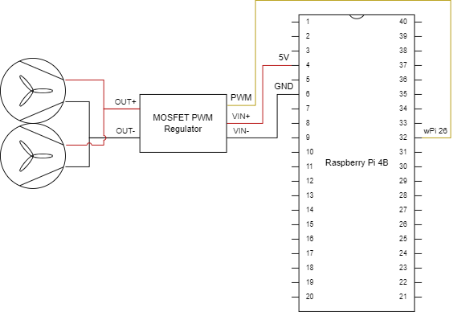

# PID GPIO Fan Control for Raspberry Pi

This project controls a GPIO-connected fan on a Raspberry Pi using a PD (Proportional-Derivative) control loop. The fan speed adjusts based on the CPU temperature to maintain optimal cooling.

## Features

- **CPU Temperature Monitoring:** Continuously monitors the Raspberry Pi's CPU temperature.
- **PD Controller:** Adjusts fan speed using a Proportional-Derivative controller to maintain optimal temperatures.
- **Dynamic Logging:** Enable or disable logging via command-line arguments and toggle logging at runtime using signals.
- **Modular Codebase:** Organized with separate header and source files for maintainability.
- **Easy Configuration:** All tunable parameters are defined using macros for easy adjustments.

## Requirements

- **Hardware:**
  - Raspberry Pi (compatible models)
  - GPIO-connected fan
  - Necessary resistors or transistors if required by your fan

- **Software:**
  - WiringPi library
  - C++11 compatible compiler

## Wiring Diagram



**Components Used:**

- **Raspberry Pi 4B 8GB RAM:**  
  The RPI serves as the main controller running the fan control software. It monitors its CPU temperature and processes the PD controller to adjust the fan speeds accordingly.

- **2x 5V GPIO Fans:**  
  These fans are connected to the GPIO pins and are controlled via PWM signals. They adjust their speed based on the temperature readings to provide efficient cooling while minimizing power consumption.

- **MOSFET PWM Regulator Controller DC 5V-36V:**  
  This module is used to drive the fans because the fans operate on **5V**, and the Raspberry Pi's **3.3V GPIO pins** are insufficient to supply the necessary power. The MOSFET module acts as a switch, allowing the low-power GPIO pin to control the higher power required by the fans safely.

**PWM Kick Mechanism:**

The fans can operate reliably from **20% PWM**. However, to ensure the fans start spinning correctly, a **100ms KICK** of **60% PWM** is applied at startup. This temporary higher PWM provides the necessary torque to initiate the fan's motion.

**Power Consumption:**

After measuring the circuit with an ammeter, we can verify the following:
- **At 50% PWM:** The fans consume **63 mA**.
- **At 100% PWM:** The fans consume **106 mA**.

**Note:** The Raspberry Pi 4B draws power for its 5V GPIO pins directly from the USB-C VIN port. This setup ensures that the current draw from the connected GPIO fans does not interfere with the Raspberry Pi's internal processing, provided that the USB-C power supply is adequately rated to handle the combined load of the Raspberry Pi and the fans.


## Installation

### **Option 1: Install WiringPi via `apt-get` (Standard Method)**

First, attempt to install WiringPi using the standard package manager:

```bash
sudo apt-get update
sudo apt-get install wiringpi
```

**Note:** If you are using an Open Media Vault (OMV) installation on your Raspberry Pi, you might encounter issues because OMV manages its own package repositories, which may not include WiringPi or may override standard Debian repositories. If the above commands fail, proceed to Option 2 below.

### **Option 2: Manually Install WiringPi from GitHub (Solution for OMV Users)**
If the standard installation doesn't work due to OMV's package management, follow these steps to manually install WiringPi:

**Install Necessary Dependencies**
```bash
sudo apt-get update
sudo apt-get install git build-essential
```

**Clone the WiringPi Repository**
```bash
git clone https://github.com/WiringPi/WiringPi.git
```

**Build and Install WiringPi**
```bash
cd WiringPi
./build
```

**Verify the Installation**
```bash
gpio -v
```
**Expected Output:**
```yaml
gpio version: 3.10
Hardware details:
  Type: Pi 4B, Revision: 05, Memory: 8192MB, Maker: Sony 
...
```

**Rebuild Your Project**
Navigate back to your project directory and build the project:
```bash
cd ~/PID_GPIO_Fan_Control_CPP
make clean
make all
```

### **Usage**
**Running the Program (Quiet by Default)**:

Execute the compiled program with appropriate permissions. GPIO access typically requires root privileges.

```bash
make run
```
**Note:** By default, the program runs in quiet mode without logging.

**Enabling Logging at Runtime**:

To enable or disable logging during runtime, send the SIGHUP signal to the running process.

1. **Find the Process ID (PID):**
```bash
pgrep pid_fan_control
```
Suppose the PID is 1234.

2. **Toggle Logging:**
```bash
sudo kill -SIGHUP 1234
```
**Output:**
```scss
Logging enabled.
```

Sending the signal again will disable logging:
```bash
sudo kill -SIGHUP 1234
```

**Output:**
```scss
Logging disabled.
```

### **Configuration**
All tunable parameters are defined in include/FanControl.h under the Definitions section. Adjust them as needed:

- FAN_GPIO_PIN: GPIO pin connected to the fan.
- TEMP_THRESHOLD: Temperature threshold for starting fan PWM.
- KP & KD: PD controller gains.
- PWM_RANGE & PWM_FREQUENCY: PWM settings.
- SAMPLE_INTERVAL_MS: Sampling interval.

### **Cleaning Up**
**To clean the build artifacts:**
```bash
make clean
```

### **Running as a Service (Optional)**
To run the fan control program as a background service that starts on boot, you can create a systemd service.

**Create a Service File**
```bash
sudo nano /etc/systemd/system/pid_fan_control.service
```

**Add the Following Content**
```ini
[Unit]
Description=PID GPIO Fan Control Service
After=network.target

[Service]
ExecStart=/home/NAS/PID_GPIO_Fan_Control/build/pid_fan_control
WorkingDirectory=/home/NAS/PID_GPIO_Fan_Control
StandardOutput=journal
StandardError=journal
Restart=always
User=root

[Install]
WantedBy=multi-user.target
```

**Reload systemd and Enable the Service**
```bash
sudo systemctl daemon-reload
sudo systemctl enable pid_fan_control.service
sudo systemctl start pid_fan_control.service
```

**Check Service Status**
```bash
sudo systemctl status pid_fan_control.service
```

**Monitor Logging**
If the pid_fan_control service is succesfully running in the background, we can view the realtime logs in the system journal. First we *Enable Logging At Runtime* and next we can use the following command:
```bash
sudo journalctl -u pid_fan_control.service -f
```

Optionally, we can view the entire history of logs with the following command:
```bash
sudo journalctl -u pid_fan_control.service
```


### **Notes**
- Safety: Ensure that your fan is compatible with PWM control and that you don't exceed its voltage and current ratings.
- Permissions: Accessing GPIO pins requires root permissions. Running the program with sudo is common.
- Signal Handling: The program listens for SIGHUP signals to toggle logging during runtime.
- WiringPi Deprecation: WiringPi is deprecated; consider using alternatives like pigpio for future projects.